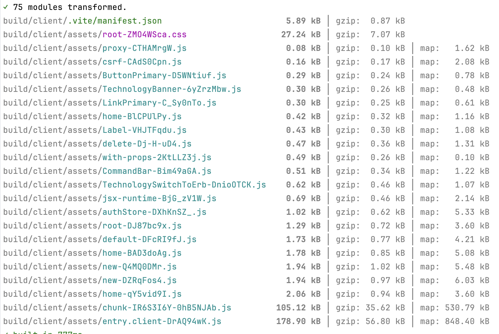

# React-Router-Vite-Rails

This is an example web application that is built using the react_router_rails_spa gem.

In addition to being very simple to set up, using an SPA framework has multiple UI/UX benefits.  

- [Jump to read how to build it](#how-it-is-built)
- [See this example app deployed using Kamal](https://rrrails.castle104.com)

## How to Use

* Download the GitHub respository.
* Install dependencies with `bundle install`
* Start the Ruby on Rails application with `bin/dev`
* Build the React application with `bin/rails react:preview`
* Access `http://localhost:3000`

If you want to use the React Router development server with HMR, instead of building the React application, run the development server with `bin/rails react:dev`.
Then access the page with ``http://localhost:5173/react`.
Note that you will not be able to switch between ERB and React pages with the React Router development server.

## Features

Here are some of the benefits of using an SPA framework, that this demo applications showcases.

### Integrated Client-side Routing

The react_router_rails_spa gem uses React Router in SPA framework mode and includes client-side routing.
It also integrates loader-based fetching.
Loader-based fetching allows parallel loading of code-split fragments and page data,
ensuring that code-splitting does not cause decrease performance due to request waterfalls.
It also eliminates fidgety and distracting flicker that is often seen in SPAs due to gradual loading of multiple elements.

### Automatic Code-splitting

When you build the React Router application using `bin/rails react:build`, you can see how the whole application is deployed inside the Rails' `public` folder. 
You can also see how the application has been split into multiple files.
Note that each route has been automatically code-split, using information from the integrated router and without manual configuration.
This will ensure that even when your application grows to hundreds of pages, the initial page load will remain fast.

### Ease of Deployment

NPM package installation and the React Router build step are integrated into the `bin/rails assets:precompile` task.
Artifacts are stored inside the Ruby on Rails `public` folder.

This means that production server configuration and CD scripts do not need any special configuration.
We deploy using Kamal and you can confirm that there are not special build steps in the `Dockerfile`.

### Integration with ERB views and Authentication

This demo includes ERB views and a simple authentication implementation.
Note how you can easily switch between ERB and React views and that they seamlessly share authentication status.

This is possible because the React application lives inside the Rails `public` folder
and shares the same domain and hence cookies. 

### SEO-optimized Pages with ERB

Although you may not need SEO for the React pages, you still may want your landing page and some marketing pages to be SEO-friendly.

As I mentioned above, it is easy to integrate SEO-optimized, server-side rendered ERB pages with React pages.

You do not need a separate SSR server like Next.js for SEO. Just use ERB.

### Reduce flicker with loaders

Flickering is a common issue with React applications and in particular SPAs.
It is challenging to prevent with CSR when fetching data inside a `useEffect()`,
and is often hidden behind a skeleton or loading screen.

React Router provides a loader-based solution which is very effective against flickering.
In this demo, we have used it whenever possible.
As a result, despite the 1-second delay artificially introduced on the server, there is no apparent flicker.
